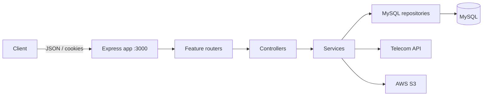

# TickHigh Fitshort Backend

REST API backend for a fitness-reel application. It supports telecom-assisted subscription and sign-in OTP flows, user sessions, reel uploads and moderation, and notifications.

> **Implementation status.** This document describes the code in `src/` and the supplied initial migration as they currently exist. The [known implementation gaps](#known-implementation-gaps) section is deliberately included: several queries and dependencies do not currently align with the migration, so a fresh installation needs those items resolved before every documented route can run successfully.

## Table of contents

- [Technology and architecture](#technology-and-architecture)
- [Project layout](#project-layout)
- [Prerequisites and installation](#prerequisites-and-installation)
- [Configuration](#configuration)
- [Database](#database)
- [Application workflow](#application-workflow)
- [Authentication and authorization](#authentication-and-authorization)
- [API conventions](#api-conventions)
- [REST API reference](#rest-api-reference)
- [Middleware, validation, and error handling](#middleware-validation-and-error-handling)
- [Security notes](#security-notes)
- [Deployment](#deployment)
- [Known implementation gaps](#known-implementation-gaps)

## Technology and architecture

| Area | Implementation |
| --- | --- |
| Runtime | Node.js, CommonJS |
| HTTP server | Express 5 |
| Database | MySQL through `mysql2/promise` connection pool |
| User auth | Telecom OTP plus signed JWT access/refresh tokens |
| Admin auth | Email/username and password (`bcrypt`), separate JWT secret |
| Media | AWS S3 presigned PUT and GET URLs |
| External service | Telecom HTTP API accessed with Axios |

The server listens on **port 3000** (hard-coded in `src/app.js`). Its base API URL is `http://localhost:3000/api`.



## Project layout

```text
backend/
├── scripts/
│   └── seedSuperAdmin.js       # Creates a super-admin record
├── src/
│   ├── app.js                  # Express bootstrap and `/api` mounting point
│   ├── routes/index.js         # Composes all feature routers
│   ├── config/                 # Database, JWT, S3, and telecom configuration
│   ├── db/migrations/          # Initial MySQL schema
│   ├── integrations/
│   │   ├── s3/                 # Presigned upload URL helper
│   │   └── telecom/            # Telecom HTTP client and response-to-flow mapper
│   ├── middlewares/            # User/admin JWT and super-admin guards
│   ├── modules/
│   │   ├── admin/              # Admin login, moderation, moderator creation
│   │   ├── auth/               # Refresh-token and logout operations
│   │   ├── authOtp/            # Existing-user OTP authentication and unsubscribe
│   │   ├── notifications/      # Notification access/update operations
│   │   ├── otp/                # Subscription OTP flow
│   │   ├── reels/              # Upload, feed, engagement, and reel ownership actions
│   │   ├── subscription/       # MSISDN status check and plan validation
│   │   └── users/              # User lookup/creation repository
│   ├── users.controller.js     # Current-user endpoint controller
│   ├── users.router.js         # Current-user route
│   └── utils/                  # JWT helpers and standard response envelope
├── package.json
└── .env                        # Local secrets; ignored by Git
```

Feature modules generally follow `router → controller → service → repository`. Controllers validate required request fields and format responses; services contain flow logic and external-service calls; repositories execute parameterized SQL.

## Prerequisites and installation

Required:

- Node.js and npm
- A MySQL server and a database
- AWS credentials with access to the configured S3 bucket (for reel endpoints)
- A reachable telecom API configured with the required service credentials (for subscription/auth OTP endpoints)

```bash
cd backend
npm install
```

Create `backend/.env` from the variables below, then initialize the database:

```bash
mysql -u <user> -p <database_name> < src/db/migrations/001_init_schema.sql
npm run dev
```

Use `npm start` for a non-reloading process. There are no implemented automated tests: the current `npm test` script intentionally exits with an error.

## Configuration

Do not commit `.env`. These are the environment variables read by source code:

| Variable | Used by | Purpose |
| --- | --- | --- |
| `DB_HOST` | `db.config.js` | MySQL host |
| `DB_USER` | `db.config.js` | MySQL username |
| `DB_PASSWORD` | `db.config.js` | MySQL password |
| `DB_NAME` | `db.config.js` | MySQL database name |
| `JWT_ACCESS_SECRET` | user JWT | Access-token signing/verifying secret |
| `JWT_REFRESH_SECRET` | user JWT | Refresh-token signing/verifying secret |
| `JWT_ADMIN_ACCESS_SECRET` | admin JWT | Admin access-token signing/verifying secret |
| `AWS_REGION` | S3 | Bucket region |
| `AWS_ACCESS_KEY_ID` | S3 | AWS access-key ID |
| `AWS_SECRET_ACCESS_KEY` | S3 | AWS secret access key |
| `AWS_S3_BUCKET_NAME` | S3 | Video bucket name |
| `TELECOM_BASE_URL` | telecom client | Remote API base URL |
| `TELECOM_SERVICE_ID` | telecom client | Telecom service ID |
| `TELECOM_CP_ID` | telecom client | Content-provider ID |
| `TELECOM_CHANNEL` | telecom client | Channel passed to subscription OTP generation |
| `TELECOM_COUNTRY` | telecom client | Country passed to subscription OTP generation |
| `TELECOM_OPERATOR` | telecom client | Operator passed to subscription OTP generation |
| `TELECOM_REQ_TYPE` | telecom client | Request type passed to subscription OTP generation |
| `TELECOM_LANGUAGE` | telecom client | Language for telecom OTP requests |
| `NODE_ENV` | auth OTP controller | Makes the auth-OTP refresh cookie `Secure` only when exactly `production` |

`PORT` may appear in the local `.env`, but it is not used; the process always uses port `3000`.

## Database

The supplied migration creates these tables:

| Table | Purpose |
| --- | --- |
| `users` | Subscriber identity keyed by unique `msisdn` |
| `admins` | Admin credentials and active flag |
| `plans` | Plan metadata; not currently queried by the API |
| `user_subscriptions` | Subscription state history/current fields; not currently written by the API |
| `otp_requests` | Subscription/auth OTP transaction audit rows |
| `refresh_tokens` | Bcrypt-hashed user refresh tokens, device/IP fields, revocation metadata |
| `reels` | Uploaded reel metadata, moderation status, aggregate counts |
| `reel_likes` | Unique user-to-reel likes |
| `reel_views` | Reel view records and `watch_pct` field |
| `notifications` | User notification payload and read state |
| `music_tracks`, `reel_audio` | Music catalogue and reel audio linkage; no routes use them |

Key relationships: a user owns reels, refresh tokens, likes, views, and notifications; a reel owns likes/views/audio; `reels.reviewed_by` references an admin. Foreign keys cascade appropriate user/reel deletions.

## Application workflow

```mermaid
sequenceDiagram
  participant C as Client
  participant A as API
  participant T as Telecom API
  participant D as MySQL
  C->>A: POST /msisdn/check
  A->>T: GET /sub/checksub
  T-->>A: subscription status
  A-->>C: nextStep
  alt new/unsub subscriber
    C->>A: POST /plan/select then /otp/send
    A->>T: GET /otp/subscribe
    C->>A: POST /otp/verify
    A->>T: GET /otp/validate_otp
    A->>D: create user if absent; store hashed refresh token
  else active/demo subscriber
    C->>A: POST /auth-otp/send then /auth-otp/verify
    A->>T: generate and validate auth OTP
    A->>D: store hashed refresh token
  end
  A-->>C: access token + HTTP-only refresh cookie
```

`/msisdn/check` maps telecom `currentStatus` to `LOW_BLANCE` for `pending`, `parking`, or `grace`; `SHOW_PLAN_PAGE` for `new` or `unsub`; and `AUTH_OTP_LOGIN` for `active` or `demo`. Any other value falls back to `SHOW_PLAN_PAGE`.

For reels: an authenticated user asks for an S3 upload URL, uploads directly to S3, then creates a reel record in `pending_review`. An authenticated admin can list pending reels, publish or reject them. The feed returns only `published` records and each returned media URL is signed for one hour.

## Authentication and authorization

### User sessions

Subscription or auth OTP verification returns an access JWT in JSON and writes the refresh JWT to the `refreshToken` cookie. The access JWT contains `{ "userId": <id> }`, lasts **15 minutes**, and is sent on protected routes as:

```http
Authorization: Bearer <accessToken>
```

The refresh JWT lasts **30 days**. Its bcrypt hash is stored in `refresh_tokens`. `POST /auth/refresh` reads the cookie, checks its signature and compares it to all stored hashes for that user; it returns a new access token without rotating the refresh token. `POST /auth/logout` deletes all refresh-token rows for the authenticated user and clears the cookie.

### Admin sessions

`POST /admin/login` returns an admin JWT in the response body. It contains `{ adminId, role }`, is signed with `JWT_ADMIN_ACCESS_SECRET`, and lasts **one hour**. Protected admin routes use the same `Authorization: Bearer <token>` header. Only a token with `role: "super_admin"` may create moderators.

## API conventions

All application-controller responses use this shape:

```json
{
  "success": true,
  "status": 200,
  "timestamp": "2026-07-27T10:00:00.000Z",
  "message": "...",
  "data": {}
}
```

Request bodies are JSON (`Content-Type: application/json`). Unless a route says otherwise, a failed controller operation returns HTTP `400`; authentication middleware returns `401`, and the super-admin middleware returns `403`. Examples below omit the changing timestamp.

## REST API reference

All paths below are relative to `/api`.

### Subscription and user OTP

| Method | URL | Auth | Required input | Success / documented errors |
| --- | --- | --- | --- | --- |
| POST | `/msisdn/check` | None | body: `msisdn` | 200; 400 missing number; 500 service failure |
| POST | `/plan/select` | None | body: `msisdn`, `subServiceId` | 200; 400 missing/invalid plan |
| POST | `/otp/send` | None | body: `msisdn`, `subServiceId` | 200; 400 missing fields/telecom error |
| POST | `/otp/verify` | None | body: `msisdn`, `otp` | 200 + refresh cookie; 400 missing fields/OTP error |
| POST | `/auth-otp/send` | None | body: `msisdn` | 200; 400 missing number/telecom error |
| POST | `/auth-otp/verify` | None | body: `msisdn`, `otp` | 200 + refresh cookie; 400 missing fields/OTP/user-not-found |
| POST | `/unsubscribe` | None | body: `msisdn` | 200; 400 missing number/telecom or user error |

`subServiceId` is validated only on `/plan/select`, where accepted values are `FDaily`, `FWeekly`, and `FMonthly`. `/otp/send` passes any supplied value to the telecom API.

```http
POST /api/msisdn/check
Content-Type: application/json

{ "msisdn": "211911961169" }
```

```json
{
  "success": true,
  "status": 200,
  "message": "MSISDN status checked successfully",
  "data": {
    "currentStatus": "new",
    "subscriptionStatus": "inactive",
    "nextStep": "SHOW_PLAN_PAGE"
  }
}
```

```http
POST /api/otp/send
Content-Type: application/json

{ "msisdn": "211911961169", "subServiceId": "FDaily" }
```

```json
{
  "success": true,
  "status": 200,
  "message": "OTP sent successfully",
  "data": { "msisdn": "211911961169", "transactionId": "telecom-transaction-id" }
}
```

```http
POST /api/otp/verify
Content-Type: application/json

{ "msisdn": "211911961169", "otp": "1234" }
```

```json
{
  "success": true,
  "status": 200,
  "message": "OTP verified successfully",
  "data": {
    "accessToken": "<user-access-jwt>",
    "user": { "id": 42, "msisdn": "211911961169" }
  }
}
```

The `auth-otp` send/verify routes use the same body shapes and success messages as the preceding OTP routes. Auth OTP verification requires a pre-existing `users` record; it does not create one. Both verify routes set `Set-Cookie: refreshToken=...; HttpOnly; SameSite=Lax; Max-Age=2592000`; subscription verification explicitly uses `Secure=false`, while auth verification uses `Secure` only in production.

Failure example:

```json
{
  "success": false,
  "status": 400,
  "message": "msisdn and otp are required",
  "data": null
}
```

### Token and profile endpoints

| Method | URL | Auth | Parameters/body | Success | Errors |
| --- | --- | --- | --- | --- | --- |
| POST | `/auth/refresh` | refresh cookie | none | 200, new `accessToken` | 401 no/invalid/unrecognized refresh token |
| POST | `/auth/logout` | user bearer token | none | 200 | 401 missing/invalid access token; 400 service error |
| GET | `/me` | user bearer token | none | 200, token `userId` | 401 missing/invalid access token |

```json
{
  "success": true,
  "status": 200,
  "message": "Token refreshed successfully",
  "data": { "accessToken": "<new-user-access-jwt>" }
}
```

### Reels

Every reel endpoint requires a valid user access token.

| Method | URL | Input | Success data | Errors |
| --- | --- | --- | --- | --- |
| GET | `/reels/upload-url?fileExtension=mp4` | query `fileExtension` | presigned `uploadUrl`, S3 `key` | 400 missing extension/S3 failure; 401 auth |
| POST | `/reels` | `title`, `rawS3Key`; optional `description`, `category` | `reelId`, `status: pending_review` | 400 missing title/key/create failure; 401 auth |
| GET | `/reels/feed` | none | published reels, each with one-hour `videoUrl` | 400 S3/query failure; 401 auth |
| GET | `/reels/my-reels` | none | all caller-owned reels | 400 query failure; 401 auth |
| GET | `/reels/:id` | path `id` | reel plus one-hour `videoUrl` | 400 not found/S3 failure; 401 auth |
| PATCH | `/reels/:id` | one or more of `title`, `description`, `category` | updated reel | 400 no fields/not found/not owner; 401 auth |
| DELETE | `/reels/:id/delete` | path `id` | deletion result | 400 not found/not owner; 401 auth |
| POST | `/reels/:id/like` | path `id` | `{ success: true, message }` | 400 already liked/database error; 401 auth |
| DELETE | `/reels/:id/like` | path `id` | `{ success: true, message }` | 400 if not previously liked; 401 auth |
| POST | `/reels/:id/view` | body `watchDuration` (at least `3`) | `{ counted: true, message: "View counted" }` | 400 duration/database error; 401 auth |

```http
POST /api/reels
Authorization: Bearer <user-access-jwt>
Content-Type: application/json

{
  "title": "Morning mobility",
  "description": "Five-minute warm-up",
  "rawS3Key": "uploads/42/uuid.mp4",
  "category": "mobility"
}
```

```json
{
  "success": true,
  "status": 200,
  "message": "Reel created successfully",
  "data": { "reelId": 7, "status": "pending_review" }
}
```

### Notifications

Every notification endpoint requires a user access token.

| Method | URL | Input | Success | Errors |
| --- | --- | --- | --- | --- |
| GET | `/notifications` | none | user's notifications | 400 repository failure; 401 auth |
| PATCH | `/notifications/:id/read` | path `id` | database update result | 400 repository failure; 401 auth |
| GET | `/notifications/unread-count` | none | `{ count }` | 400 query failure; 401 auth |
| PATCH | `/notifications/mark-all-read` | none | database update result | 400 update failure; 401 auth |
| DELETE | `/notifications/:id/delete` | path `id` | database delete result | 400 missing/not-owner notification; 401 auth |

```json
{
  "success": true,
  "status": 200,
  "message": "Unread count fetched successfully",
  "data": { "count": 3 }
}
```

### Admin and moderation

| Method | URL | Auth | Input | Success | Errors |
| --- | --- | --- | --- | --- | --- |
| POST | `/admin/login` | None | `identifier`, `password` | 200 admin token and profile | 400 missing/invalid credentials |
| POST | `/admin/create-moderator` | super-admin bearer token | `username`, `email`, `password` | 200 moderator profile | 400 missing/duplicate values; 401/403 auth/role |
| GET | `/admin/reel/pending` | admin bearer token | none | 200 pending reels with one-hour `videoUrl` | 400 service/S3 error; 401 auth |
| PATCH | `/admin/reels/:id/approve` | admin bearer token | path `id` | 200 SQL update result | 400 service error; 401 auth |
| PATCH | `/admin/reels/:id/reject` | admin bearer token | path `id`, body `reason` | 200 SQL update result | 400 missing reason/service error; 401 auth |
| DELETE | `/admin/reels/:id/delete` | admin bearer token | path `id`, body `reason` | 200 SQL update result | 400 missing reason/service error; 401 auth |

```http
POST /api/admin/login
Content-Type: application/json

{ "identifier": "moderator@example.com", "password": "<password>" }
```

```json
{
  "success": true,
  "status": 200,
  "message": "Login successful",
  "data": {
    "token": "<admin-access-jwt>",
    "admin": { "id": 1, "username": "moderator", "email": "moderator@example.com", "role": "moderator" }
  }
}
```

The root `GET /` endpoint is outside `/api`, unauthenticated, and responds with plain text: `Hello World!`.

## Middleware, validation, and error handling

| Component | Behavior |
| --- | --- |
| `express.json()` | Parses JSON request bodies globally |
| `cookie-parser` | Parses cookies so refresh can read `req.cookies.refreshToken` |
| `authenticateUser` | Requires `Authorization: Bearer …`, verifies with `JWT_ACCESS_SECRET`, sets `req.user` |
| `authenticateAdmin` | Requires the same header form, verifies with `JWT_ADMIN_ACCESS_SECRET`, sets `req.admin` |
| `requireSuperAdmin` | Requires `req.admin.role === "super_admin"` |
| `apiResponse` | Produces the common `success`, `status`, `timestamp`, `message`, `data` JSON envelope |

Validation is manual and presence-based in controllers. There is no schema-validation library, no validation of MSISDN/OTP format, no reel-ID numeric check, and no global Express error handler. Errors that are caught by controllers are formatted; uncaught errors use Express's default behavior.

## Security notes

Existing safeguards include parameterized MySQL queries, bcrypt hashes for passwords and stored refresh tokens, short-lived user access JWTs, HTTP-only refresh cookies, separate user/admin signing secrets, ownership checks for changing/deleting reels, and S3 presigned URLs with finite expiry (20 minutes for upload, one hour for reads).

Before production, address the issues below and additionally apply HTTPS, CORS policy, `Secure` cookies consistently, rate limiting (especially OTP/login routes), input schemas/length limits, S3 key/content-type allowlists, centralized error logging without returning error objects, token revocation/rotation checks, and least-privilege AWS/database credentials.

## Deployment

1. Provision MySQL, the S3 bucket, and telecom credentials; run the migration after resolving its schema mismatches below.
2. Provide all configuration values as protected environment variables in the deployment platform.
3. Install production dependencies with `npm ci --omit=dev`.
4. Start with `npm start`; route public traffic to port `3000` and terminate TLS at the platform/reverse proxy.
5. Set `NODE_ENV=production` so the auth-OTP refresh cookie uses `Secure`; ensure the client sends cookies over HTTPS.
6. Add health checks, structured log collection, database backups, and monitoring around the telecom and S3 dependencies.

## Known implementation gaps

These are observed directly from the current code and migration:

- `src/app.js` requires `cookie-parser`, but `cookie-parser` is absent from `package.json`; the server cannot start until it is installed and recorded as a dependency.
- On case-sensitive filesystems, `subscription.controller.js` requires `../../utils/ApiResponse`, but the file is named `apiResponse.js`; module loading will fail.
- The migration's `admins` table has no `username` or `role`, though admin login, creation, and the seed script require both. The seed script therefore also fails against the supplied migration.
- The migration defines `reels.reject_reason` and a status enum without `deleted`; admin repository updates use `rejection_reason` and set status `deleted`.
- The migration's `reel_views` has `watch_pct`, while the repository inserts `watch_duration`; view recording will fail with that schema.
- Notification creation has no route that invokes it. The repository stores its supplied reel ID and message inside the schema's JSON `payload` column.
- `/unsubscribe` only calls telecom and verifies a local user. It does not update `user_subscriptions`, despite the TODO in code.
- Admin moderation updates return raw MySQL result objects and do not first verify that a reel exists. `approveReel` also swallows repository errors and can return an apparent 200 response with `null` data.

---

## Real-Time Redis & FFmpeg Transcoding Core Architecture

This section details the core logic and working mechanism of the newly integrated **Redis Engagement Engine** and **FFmpeg Background Transcoding Pipeline**.

---

### 1. Redis Real-Time Counters Core Logic (`src/utils/redis.util.js`)

#### A. Tenant Isolation Key Pattern
To prevent data contamination in a multi-tenant setup, all Redis keys strictly follow the tenant-isolated pattern:
* Views Key: `tenant:{tenantId}:reel:{reelId}:views`
* Likes Key: `tenant:{tenantId}:reel:{reelId}:likes`
* Dirty Views Set: `tenant:{tenantId}:reel:dirty_views`
* Dirty Likes Set: `tenant:{tenantId}:reel:dirty_likes`

#### B. Instant Atomic Operations
- When a user likes a reel (`POST /reels/:id/like`) or views a reel (`POST /reels/:id/view`), the request bypasses heavy MySQL `UPDATE` write locks.
- Redis executes an in-memory **atomic increment** (`INCR`) or decrement (`DECR`) in **< 1ms**.
- Simultaneously, the modified reel ID is pushed to the Redis dirty set (`SADD`).

#### C. Database Batch Sync Worker (`src/workers/sync-counters.worker.js`)
- **Execution**: Runs on startup and loops every 3 minutes (or via cron/PM2).
- **Core Workflow**:
  1. Reads all modified reel IDs from `dirty_views` and `dirty_likes` sets.
  2. Fetches total accumulated views and likes from Redis in a single pipeline (`MGET`).
  3. Bulk-updates the MySQL `reels` table (`UPDATE reels SET view_count = ?, like_count = ? WHERE id = ?`).
  4. Removes synced reel IDs from the dirty set (`SREM`).
- **Benefit**: Eliminates database deadlocks and server crashes under high concurrent user engagement.

---

### 2. FFmpeg Adaptive Bitrate Transcoding Core Logic (`src/workers/reelTranscode.worker.js`)

#### A. Asynchronous Queue Pipeline (`src/queues/reelTranscode.queue.js`)
- Video processing is CPU-heavy. When a user uploads a video (`POST /reels`), the Express server saves the DB record as `pending_review` and pushes a job `{ reelId, s3Key }` to the **Bull Queue (Redis-backed)**.
- The HTTP request returns **200 OK instantly**, keeping the API fast and responsive.

#### B. Multi-Bitrate HLS Transcoding Pipeline
When the background worker picks up the job:
1. **Download Raw Input**: Downloads raw uncompressed MP4 video from AWS S3 (`uploads/{userId}/{uuid}.mp4`) to local temp directory.
2. **Thumbnail Extraction**: Uses FFmpeg to capture a frame at timestamp `00:00:01` and saves it as `thumbnails/{reelId}/thumb.jpg`.
3. **Adaptive Bitrate HLS Stream Generation**:
   FFmpeg encodes 3 variant streams optimized for different network speeds:
   - **360p Variant (`360p.m3u8`)**: `640x360` resolution, `800k` video bitrate, `96k` audio bitrate *(Optimized for 2G/3G & Low Internet Speeds)*.
   - **480p Variant (`480p.m3u8`)**: `854x480` resolution, `1400k` video bitrate, `128k` audio bitrate *(Medium Speed)*.
   - **720p Variant (`720p.m3u8`)**: `1280x720` resolution, `2800k` video bitrate, `128k` audio bitrate *(HD Speed)*.
4. **Master Playlist (`master.m3u8`) Creation**:
   - Generates a master playlist indexing all 3 variant playlists with bandwidth thresholds.
   - End-user video players (HLS.js, ExoPlayer, AVPlayer) read `master.m3u8` and **dynamically switch video quality in real-time** based on current network bandwidth.
5. **S3 Upload**:
   - Uploads `.m3u8` playlists and `.ts` video chunks to S3: `hls/{reelId}/master.m3u8`.
   - Uploads thumbnail to S3: `thumbnails/{reelId}/thumb.jpg`.
6. **DB & File Cleanup**:
   - Updates MySQL `reels` table: `hls_s3_key = hls/{reelId}/master.m3u8`, `thumb_s3_key = thumbnails/{reelId}/thumb.jpg`, `transcoding_status = completed`.
   - Deletes all local temporary files.

